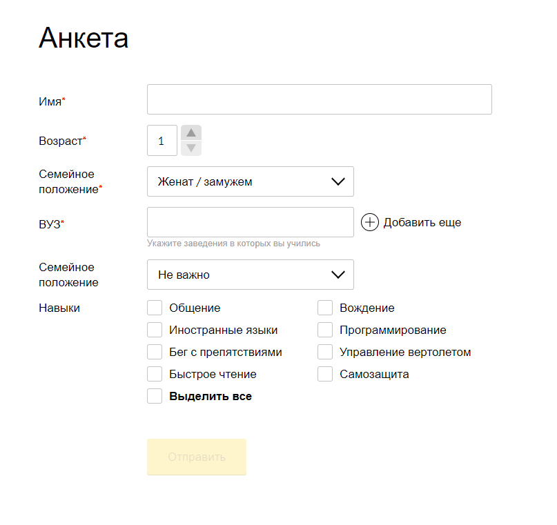

# Тестовое задание для Background.

Генератор форм из json-объекта - при загрузке страницы запрашивается json-объект и на его основе строится форма с различными полями.

---

### [Ссылка на готовый вариант](https://getvion.github.io/test-background-form-generator/)

### Запуск локально

1. Скопируйте этот репозиторий с помощью команды `git clone git@github.com:Getvion/test-background-form-generator.git`
2. Для установки зависимостей `npm i`
3. После установки зависимостей введите каманду `ng serve`



### Пример JSON файла для создания формы:

```
name: {
  required: true,
  isExtendable: false,
  labelText: 'Имя',
  inputType: 'text',
  inputSize: 'long',
},
age: {
  required: true,
  labelText: 'Возраст',
  inputType: 'number',
},
family: {
  required: true,
  labelText: 'Семейное положение',
  items: ['Женат / замужем', 'Не женат / не замужем'],
},
university: {
  descriptoin: 'Укажите заведения в которых вы учились',
  required: false,
  labelText: 'ВУЗ',
  isExtendable: true,
  items: [{ inputType: 'text', inputSize: 'middle' }],
},
birthPlace: {
  required: false,
  labelText: 'Место рождения',
  items: [Не важно',Астрахань',Волгоград',Волжский',Ростов-на-Дону',Саратов',Элиста'],
},
skills: {
  required: false,
  labelText: 'Навыки',
  items: [
    { text: 'Общение', isChecked: true },
    { text: 'Вождение', isChecked: false },
    { text: 'Иностранные языки', isChecked: true },
  ],
},

```

---

### Технлогии

- Angular, Angular CLI
- TypeScript
- RxJS
- SCSS
- esLInt
- Prettier
